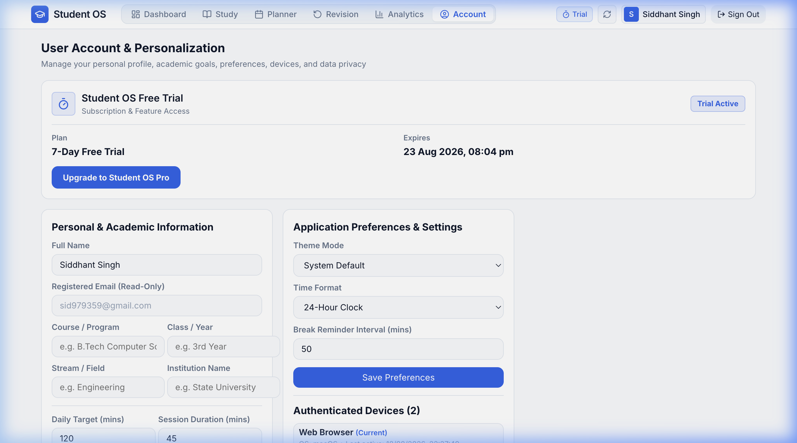
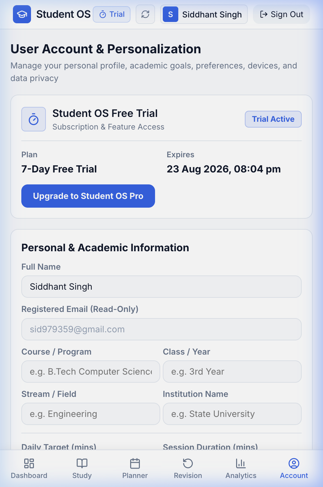

# Account & Settings

The **Account & Settings** module allows you to personalize your student profile, configure study preferences, customize the visual theme, manage authenticated devices, and oversee your Pro subscription.

---

## Account Workspace Overview

---

## 1. Personal & Academic Profile

Keep your academic records current:
- **Full Name**: Your preferred name displayed across greetings and certificates.
- **Email Address**: Your verified login identifier.
- **Course / Degree**: Your enrolled academic program (e.g., *B.Tech Computer Science*, *MBBS*, *B.A. Economics*, *High School*).
- **Academic Year**: Current year of study (e.g., *1st Year*, *2nd Year*, *Final Year*).
- **Stream / Major**: Your primary field of specialization.
- **Institution / University**: Your school, college, or university name.

Click **Save Profile Changes** to persist updates.

---

## 2. Study Targets & Preferences

Customize how Student OS adapts to your personal rhythm:

- **Daily Study Target**: Set your daily focus objective in hours (e.g., *3.5 hours/day*).
- **Default Session Duration**: Preferred length for standard study sessions (e.g., *45 mins*).
- **Preferred Study Time**: Indicate when you are most productive (*Morning*, *Afternoon*, *Evening*, or *Night*).
- **Revision Strategy**: Choose between **Automated Spaced Repetition** (recommended) or **Manual Scheduling**.

---

## 3. Appearance & Formatting Preferences

- **Theme Mode**:
  - 🌙 **Dark Mode**: High-contrast, OLED-friendly dark interface ideal for late-night study sessions.
  - ☀️ **Light Mode**: Clean, crisp daytime theme with high legibility.
  - 💻 **System Default**: Automatically matches your operating system theme.
- **Time Format**: Switch between **12-Hour format** (*02:30 PM*) and **24-Hour format** (*14:30*).
- **Break Interval Reminders**: Configure gentle audio/visual notifications to step away and rest your eyes (e.g., *Every 25 mins (Pomodoro)* or *Every 45 mins*).

---

## 4. Subscription & Access Status

The **Subscription** card displays your current entitlement:
- **Active Plan Badge**: Displays **FREE TRIAL (Active)** or **STUDENT OS PRO**.
- **Trial Expiration Date**: Clearly indicates how many days remain in your 7-day trial.
- **Upgrade Trigger**: Click **Upgrade to Student OS Pro** to open the Pro subscription selector.

---

## 5. Authenticated Devices Management

Student OS ensures secure access across your devices:
- Lists all active browsers and mobile devices currently logged into your account.
- Displays device model, operating system, and last active timestamp.
- **Revoke Device**: Click **Revoke** next to any unrecognized or old device to immediately terminate its active session.

---

## 6. Cross-Platform Quick Links

Located conveniently in your Account settings:
- **Student OS on Web**: Direct link to access your workspace from any computer at [`studentos.kryvlance.in`](https://studentos.kryvlance.in).
- **Student OS for Android**: Direct link to download the latest release APK (`StudentOS-v1.0.4.apk`) with home screen widgets and background timer service.

---

## 7. Sign Out & Danger Zone

- **Sign Out**: Safely terminates your current session and returns you to the login screen.
- **Delete Account (Danger Zone)**: Permanently purges all subjects, chapters, focus history, planner tasks, and revisions. To prevent accidental deletion, a confirmation dialog requires typing the word `DELETE`.

---

## Mobile Account Experience

All account, profile, theme, and device settings are fully accessible from the bottom **Account** tab on mobile.
