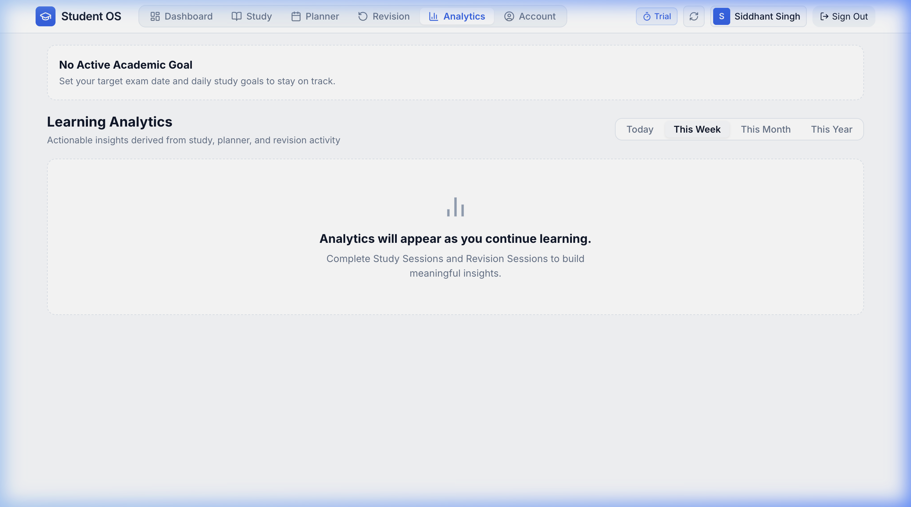

# Learning Analytics

The **Analytics** module transforms your raw study sessions, planner checkmarks, and revision logs into actionable insights. It helps you identify productivity patterns, spot neglected subjects, and maintain long-term consistency.

---

## Analytics Workspace Overview

---

## 1. Time Period Filters

At the top right of the Analytics screen, choose from four flexible time horizons:

- **Today**: Real-time breakdown of your current day's output.
- **This Week**: 7-day retrospective (Monday to Sunday) to measure weekly goals.
- **This Month**: 30-day view for syllabus pacing and monthly trends.
- **This Year**: Comprehensive historical archive across entire semesters or academic years.

---

## 2. High-Level Performance Metrics

The top metric row provides four key productivity indicators:

1. **Total Focus Time**: Sum of all regular study sessions logged in the selected period (e.g., *18h 30m*).
2. **Total Revision Time**: Total time spent reviewing spaced repetition items (e.g., *4h 15m*).
3. **Total Sessions Logged**: Number of discrete study blocks completed.
4. **Planner Execution Accuracy**: Percentage ratio of scheduled tasks successfully executed.

---

## 3. Focus Time Trend Chart

The central bar chart visualizes your daily study volume over time:
- **Daily Bars**: Each bar shows total minutes studied on that day.
- **Target Pace Line**: A benchmark line displays your target daily pace (e.g., *180 mins/day*), making it immediately clear when you exceeded or fell short of your target.
- **Hover Insights**: Hover over any bar to see exact minutes and session count for that specific date.

---

## 4. Subject Distribution Breakdown

A dedicated chart and percentage table breaks down your study time by subject:
- **Visual Distribution**: See which subjects are absorbing most of your focus (e.g., *Computer Science 45%*, *Mathematics 35%*, *Physics 20%*).
- **Neglect Warning**: Identify subjects you haven't studied in over 7 days, allowing you to rebalance your upcoming planner schedule.

---

## 5. Consistency & Streak Metrics

- **Current Active Streak**: Number of consecutive days with at least one completed study session.
- **Longest Historical Streak**: Your personal best streak record.
- **Total Active Days**: Overall number of days you actively engaged with Student OS.

---

## 6. How to Interpret & Act on Your Analytics

| Observation in Analytics | Recommended Adjustment |
| :--- | :--- |
| **High focus time but low planner accuracy** | You are studying hard, but diverging from your plan. Create fewer, more realistic planner blocks. |
| **One subject dominates >60% of total time** | Rebalance your schedule by allocating high-priority morning slots to neglected subjects. |
| **Consistent drop in weekend focus time** | Set a lighter, realistic weekend target (e.g., 60 mins of revision only) to preserve your streak without burnout. |
