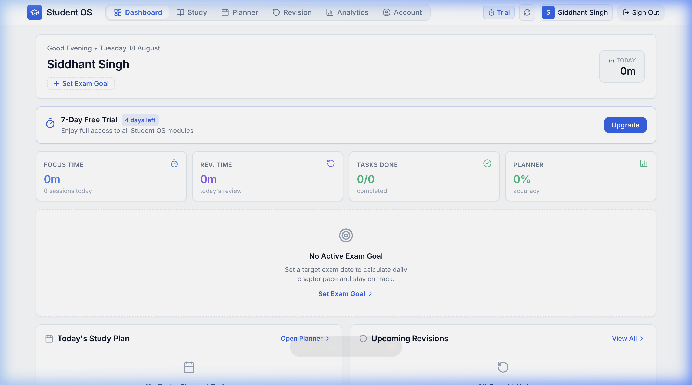
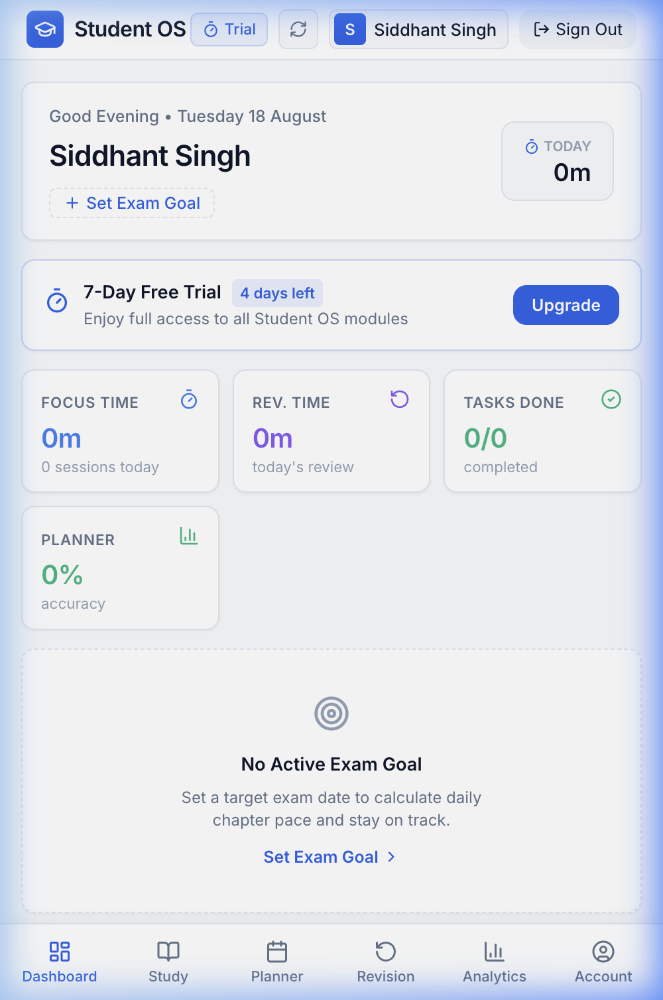

# Student OS Dashboard

The **Dashboard** is your central daily command center. Every time you open Student OS, the dashboard synthesizes your active exam goals, daily focus hours, scheduled planner tasks, due revisions, and historical streaks into one glanceable interface.

---

## Desktop Dashboard Overview



### Key Interface Sections & Callouts

```
┌────────────────────────────────────────────────────────────────────────┐
│ [1] Identity Header: Greeting, Date, Current Streak & Active Goal %    │
├────────────────────────────────────────────────────────────────────────┤
│ [2] Exam Goal Detail Card: Target Date, Countdown, 4-Stat Pace Grid    │
├────────────────────────────────────────────────────────────────────────┤
│ [3] Primary Metric Strip: Focus Time | Revision | Tasks | Accuracy     │
├──────────────────────────────────┬─────────────────────────────────────┤
│ [4] Today's Study Plan           │ [5] Upcoming Spaced Revisions       │
│     Priority tasks & checkboxes  │     Due items & retention score     │
├──────────────────────────────────┴─────────────────────────────────────┤
│ [6] 16-Week Consistency Activity Heatmap & Quick Action Shortcuts      │
└────────────────────────────────────────────────────────────────────────┘
```

---

## 1. Identity & Goal Header `[1]`

Located at the top of the dashboard, the identity section provides instant contextual orientation:
- **Personal Greeting & Date**: Displays a greeting (*Good Morning / Good Afternoon / Good Evening*) alongside the current formatted date.
- **Active Exam Badge**: Highlights your current primary examination goal.
- **Glanceable Status Strip**:
  - **Streak Days**: Tracks consecutive days with recorded study activity (marked with a flame icon 🔥).
  - **Today's Focus**: Summarizes total focus minutes accumulated today.
  - **Goal Completion**: Displays total syllabus completion percentage.
  - **Active Session Tracker**: If a study session is currently running or paused, a live timer widget appears directly in the header with a quick **Continue Study / Resume Session** button.

---

## 2. Exam Goal Progress Card `[2]`

If an exam goal is configured, this card calculates your exact trajectory toward exam day:
- **Exam Title & Status Badge**: Indicates whether you are **ON TRACK**, **AHEAD**, **AT RISK**, **BEHIND**, or **NOT STARTED** based on your current completion rate.
- **Target Deadline**: Displays the projected exam date alongside a real-time countdown of **days and weeks remaining**.
- **Visual Progress Bar**: Shows total completed chapters versus target syllabus chapters with percentage indicators.
- **4-Stat Pace Strip**:
  - **Completed**: Number of chapters fully finished.
  - **Remaining**: Number of chapters pending study.
  - **Daily Pace**: Target study minutes required per day to complete syllabus on time.
  - **Chapters / Day**: Average chapter completion velocity needed per day.

---

## 3. Primary Metric Strip `[3]`

Four high-visibility cards summarize your daily academic output:

1. **Focus Time**: Total time spent in active study sessions today (e.g., *1h 45m*).
2. **Revision Time**: Total time dedicated to spaced repetition review sessions today.
3. **Tasks Completed**: Progress ratio of planner tasks completed today (e.g., *3/4 Tasks*).
4. **Planner Accuracy**: Percentage comparison of planned study blocks versus actual execution.

---

## 4. Today's Study Plan `[4]`

The left column of your workspace displays your prioritized tasks for the day:
- **Priority Badges**: Tasks are color-coded into **High** (Red), **Medium** (Amber), and **Low** (Green) priority.
- **Interactive Checkboxes**: Click any checkbox to mark a task as completed directly from the dashboard.
- **Associated Subject**: Displays the linked subject name and estimated duration.
- **Carryover Reminder**: If yesterday had unfinished tasks, a helpful prompt lets you review or reschedule them.

---

## 5. Upcoming Spaced Revisions `[5]`

The right column displays your memory retention queue:
- **Due Revision Items**: Lists subjects and chapters scheduled for review today.
- **Repetition Stage**: Indicates the current spaced repetition interval (Stage 1, Stage 2, Stage 3, or Stage 4).
- **Average Retention Score**: An algorithmically computed retention health percentage (e.g., *94%*).
- **Direct Start**: Click any revision item to launch an active revision session immediately.

---

## 6. 16-Week Consistency Heatmap `[6]`



At the bottom of the dashboard, a 16-week interactive consistency grid visualizes your study habit over the last 112 days:
- **Color Intensity**: Darker blue blocks represent higher study durations (≥30m, ≥60m, ≥120m, ≥180m).
- **Interactive Tooltips**: Hover over or tap any day block to inspect:
  - Exact date
  - Total study minutes logged
  - Number of completed revisions
  - Tasks completed vs. total planned
- **Direct Navigation**: Clicking any day in the heatmap opens that date in the **Academic Planner**.

---

## Mobile Dashboard Experience

On Android and mobile browsers, the dashboard adapts seamlessly into a vertically optimized scrollable feed with all cards stacked for effortless one-handed navigation.
