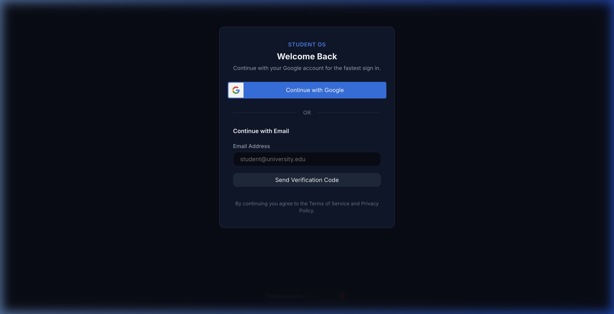

# Getting Started with Student OS

This guide walks you through signing in, setting up your workspace, and understanding the core interface of Student OS across Web and Android.

---

## 1. Signing Into Your Account

Student OS uses a modern, secure, and passwordless authentication system. You do not need to memorize or manage complex passwords.



### Sign-In Options

#### Option A: Email Verification Code (OTP) — Recommended
1. Enter your registered email address into the **Email Address** field.
2. Click **Send Verification Code**.
3. Check your email inbox for a 6-digit numeric verification code (valid for 5 minutes).
4. Enter the 6-digit code on the verification screen and click **Verify Code & Continue**.
5. If you do not have an account yet, one will be created automatically upon your first successful verification.

#### Option B: Google Single Sign-On (SSO)
1. Click the **Continue with Google** button.
2. Select your Google account in the popup dialog.
3. You will be authenticated immediately and directed to your Student OS workspace.

> **Security Note**: Every new account automatically starts with a **7-Day Full Access Free Trial**. No credit card or upfront payment is required.

---

## 2. First-Time Setup Workflow

When you first log in, follow these three quick steps to configure your workspace:

```
Step 1: Set Exam Goal ──► Step 2: Add Subjects & Chapters ──► Step 3: Start First Study Block
 (Target Date & Chapters)     (Your active curriculum)          (Timer logs your focus)
```

1. **Set Your Target Exam Goal**:
   - Go to **Planner** or click **Set Exam Goal** on the Dashboard.
   - Enter your target exam name (e.g., *UPSC CSE 2026*, *NEET 2026*, *Semester Finals*), target exam date, and total chapters to cover.
   - Student OS will instantly compute your required daily study pace.
2. **Add Your Subjects & Chapters**:
   - Navigate to the **Study** module.
   - Click **+ Subject** to add your courses (e.g., *Physics*, *Mathematics*, *Organic Chemistry*).
   - Select a subject and click **+ Chapter** to list your syllabus topics.
3. **Launch Your First Study Session**:
   - Choose your subject and chapter, then click **Start Study Session**.

---

## 3. Understanding Main Navigation

Student OS is structured into six focused modules accessible via the navigation bar:

| Module | Purpose |
| :--- | :--- |
| **Dashboard** | Your central mission control: exam countdown, today's focus metrics, streak, today's plan, and upcoming revisions. |
| **Study** | Your active study engine: subject syllabus management, chapter checklists, high-contrast digital stopwatch, and daily focus timeline. |
| **Planner** | Your schedule engine: daily time blocks, weekly roadmap, monthly calendar, and task priority lists. |
| **Revision** | Your memory retention engine: automated spaced repetition queues (Due Today, Overdue, Scheduled) and retention scoring. |
| **Analytics** | Your performance dashboard: study time trends, subject breakdown charts, and streak histories across flexible time periods. |
| **Account** | Your personal preferences: student profile, dark/light theme toggle, 12h/24h time format, break reminders, device management, and Pro subscription details. |

### Desktop Navigation Layout
On desktop and laptop browsers, the top header gives you quick access to all modules, a one-click **Refresh Data** button, your student profile badge, and the **Sign Out** button.

### Mobile Navigation Layout (Android & Mobile Web)
On mobile devices, a persistent bottom navigation bar provides one-tap switching between **Dashboard**, **Study**, **Planner**, **Revision**, and **Account**.

---

## Next Steps

- Explore the [**Dashboard Guide**](./dashboard.md) to understand your daily metrics.
- Master active study sessions in the [**Study Engine Guide**](./study.md).
