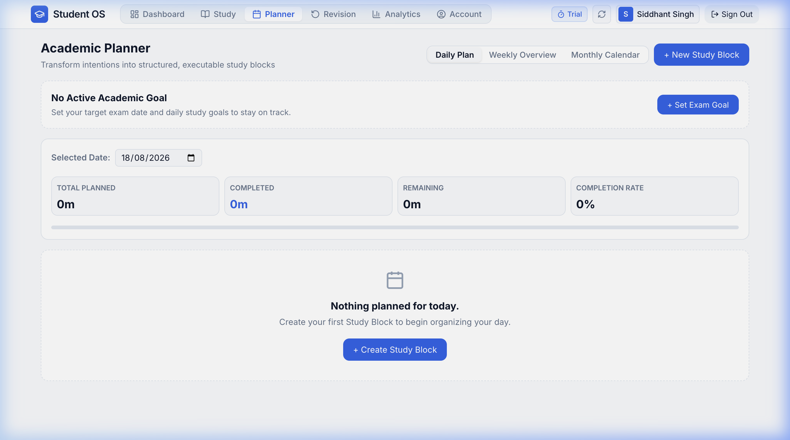
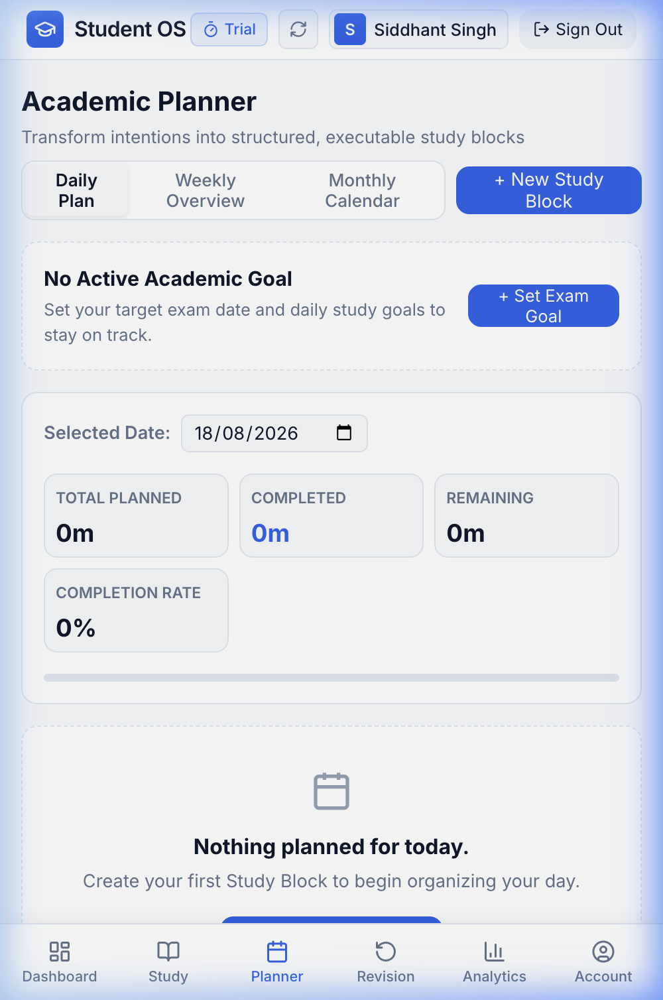

# Academic Planner

The **Academic Planner** transforms your study intentions into structured, actionable time blocks. It bridges the gap between what you want to achieve and what you actually execute on a daily, weekly, and monthly basis.

---

## Planner Workspace Overview



---

## 1. Creating a Study Block (Task)

To add a planned study session or assignment:
1. Click the **+ New Study Block** button in the top right of the Planner header.
2. Fill in the task details:
   - **Task Title**: Name of the task (e.g., *Solve 50 Calculus MCQs*, *Read Chapter 4 Notes*, *Complete Assignment 2*).
   - **Subject**: Link the task to an existing subject from your syllabus.
   - **Target Date**: Choose when the task should be done (defaults to today).
   - **Estimated Duration**: Planned study time in minutes (e.g., *45 mins*, *90 mins*).
   - **Priority**: Select **High** (urgent/exam critical), **Medium** (standard study), or **Low** (optional reading).
3. Click **Create Study Block**.

---

## 2. Planner Views

The planner offers three switchable views via the top tab toggle:

```
┌────────────────────────────────────────────────────────────────────────┐
│ [ Daily Plan ]          [ Weekly Overview ]        [ Monthly Calendar ]│
└────────────────────────────────────────────────────────────────────────┘
```

### A. Daily Plan View
The default daily view organizes tasks for a single selected date:
- **Date Selector**: Use the left/right arrows or date picker to navigate to any past or upcoming day.
- **Daily Progress Summary**: Displays total planned study time, completed tasks count, and completion percentage bar.
- **Priority Groupings**:
  - **High Priority Tasks**: Displayed in prominent red badge containers for immediate attention.
  - **Medium Priority Tasks**: Displayed with amber indicators.
  - **Low Priority Tasks**: Displayed with green indicators.
  - **Completed Tasks**: Displayed with strikethrough styling and green checkmarks at the bottom of the list.

### B. Weekly Overview View
Provides a 7-day horizontal timeline:
- Gives you a bird's-eye view of your study load across the current week.
- Helps identify overloaded days and balance your schedule before deadlines hit.

### C. Monthly Calendar View
Presents a full interactive 30-day calendar:
- Each day block displays total scheduled study minutes and task completion indicators.
- Click any day in the monthly calendar to immediately open and view that specific day's Daily Plan.

---

## 3. Managing & Rescheduling Tasks

| Action | How to Perform |
| :--- | :--- |
| **Complete a Task** | Click the circular checkbox beside the task title. It immediately marks the task finished and recalculates your daily completion percentage. |
| **Edit Task Details** | Click the **Edit** button on any task card to modify the title, subject, estimated duration, or priority. |
| **Reschedule Task** | Click **Reschedule** to move an unfinished task to tomorrow or any future date. |
| **Delete Task** | Click **Delete** to remove a task permanently from your planner. |

---

## 4. Mobile Planner Experience



On the Student OS Android app and mobile view:
- Easily switch dates with large swipeable date tabs.
- Quick one-tap checkbox completion makes it effortless to tick off tasks while studying at your desk or in the library.
- Fast floating action triggers allow you to jot down new tasks in seconds.
