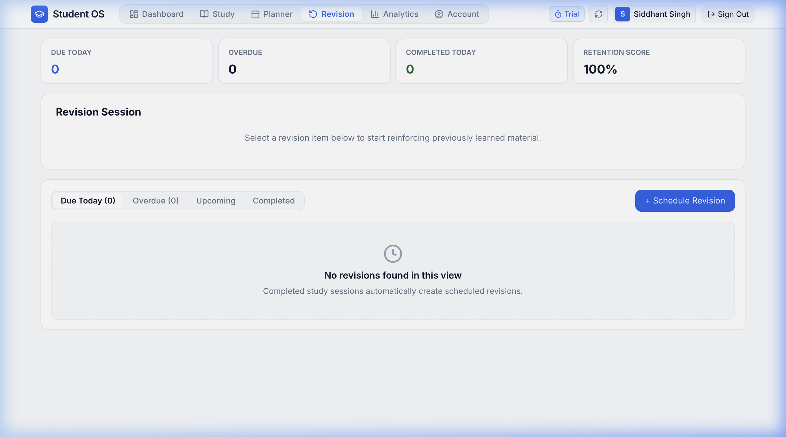
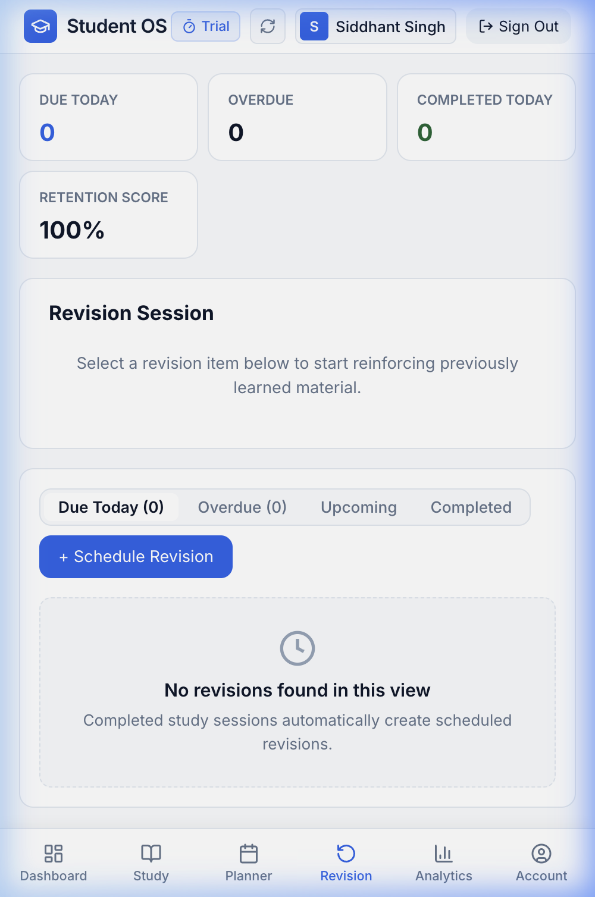

# Spaced Repetition Revision Tracker

The **Revision Tracker** is your memory retention engine. It utilizes evidence-based spaced repetition algorithms to ensure you review learned topics at scientifically optimized intervals before they slip from memory.

---

## Revision Workspace Overview



---

## 1. How Spaced Repetition Works in Student OS

When you finish studying a new topic, your retention begins to decay exponentially according to the Ebbinghaus Forgetting Curve. Student OS counteracts this by automatically scheduling structured review checkpoints:

```
First Study (Day 0) ──► Stage 1 Review (+1 Day) ──► Stage 2 Review (+3 Days) ──► Stage 3 Review (+7 Days) ──► Stage 4 (+21 Days)
```

1. **Stage 1 (Day 1)**: Initial memory reinforcement 24 hours after first study.
2. **Stage 2 (Day 3)**: Secondary consolidation into medium-term memory.
3. **Stage 3 (Day 7)**: Conceptual connection and problem-solving practice.
4. **Stage 4 (Day 21)**: Long-term crystallization before examination day.

---

## 2. Key Revision Metric Cards

At the top of the Revision screen, four metric cards provide a complete overview of your revision pipeline:

1. **Due Today**: Total number of revision items scheduled for review today.
2. **Overdue**: Items whose scheduled review dates have passed without completion (highlighted in red if > 0).
3. **Completed Today**: Number of revision sessions successfully finished today.
4. **Retention Score**: An aggregate retention health percentage (e.g., *94%*). Completing items on time boosts your score, while accumulating overdue items gradually lowers it.

---

## 3. Queue Tabs & Filter Views

Organize your revision workflow using the four queue filter tabs:

- **Due Today**: All topics ready for immediate review today.
- **Overdue**: Urgent topics that need catch-up review to prevent memory loss.
- **Upcoming (Scheduled)**: Future revision items queued for upcoming days.
- **Completed**: Historical archive of completed revision cycles.

---

## 4. Running a Revision Session

```
Click "Start Revision" ──► Review Topic Notes ──► Add Completion Notes ──► "Complete & Save"
```

1. Locate the item in your **Due Today** or **Overdue** queue.
2. Click **Start Revision**.
3. A focused revision timer launches, displaying the subject name, chapter, and active duration.
4. When you finish reviewing the concepts or solving revision practice problems, click **Complete & Save**.
5. *(Optional)* Add **Completion Notes** summarizing key takeaways or difficult formulas.
6. The item automatically advances to its next spaced repetition stage.

### Additional Actions on Revision Items
- **Reschedule**: If your schedule is packed, reschedule an item to tomorrow without resetting its stage.
- **Archive**: Remove topics you have mastered permanently from the active queue.

---

## 5. Mobile & Android Revision Experience



On the Student OS Android app:
- Check your daily revision queue during your commute or between classes.
- Receive daily **Spaced Repetition Reminders** alerting you to due revision topics before your retention drops.
