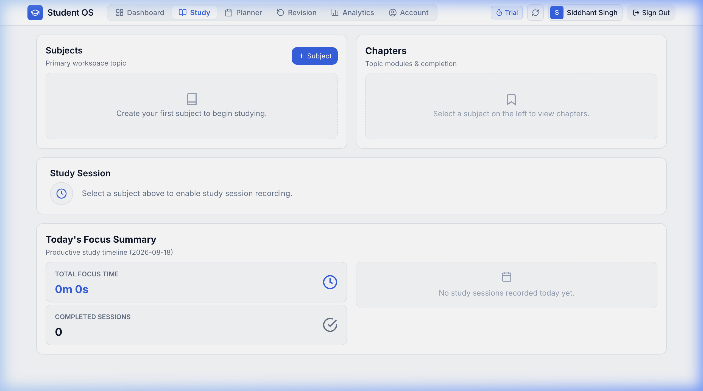
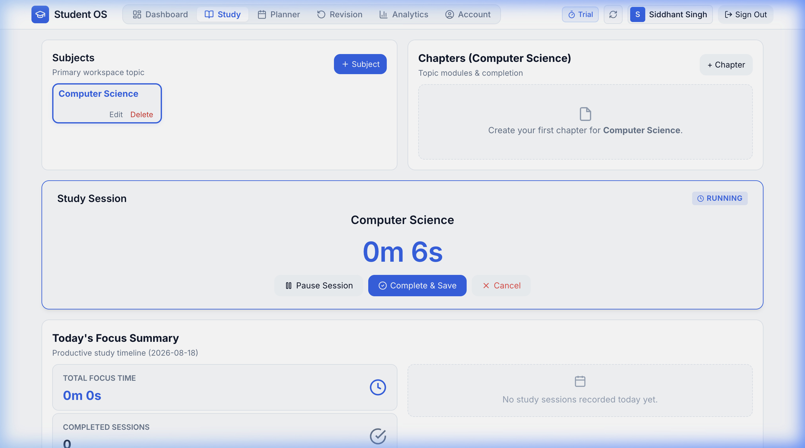
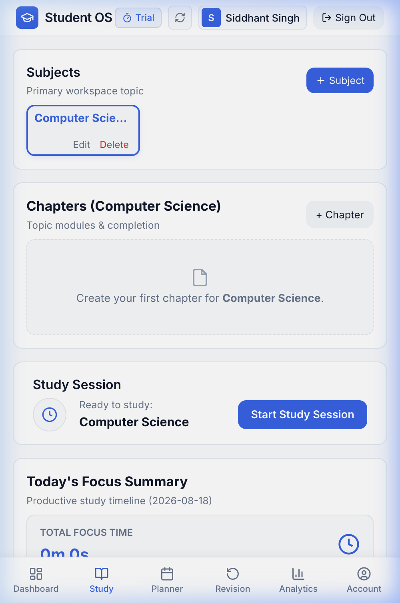
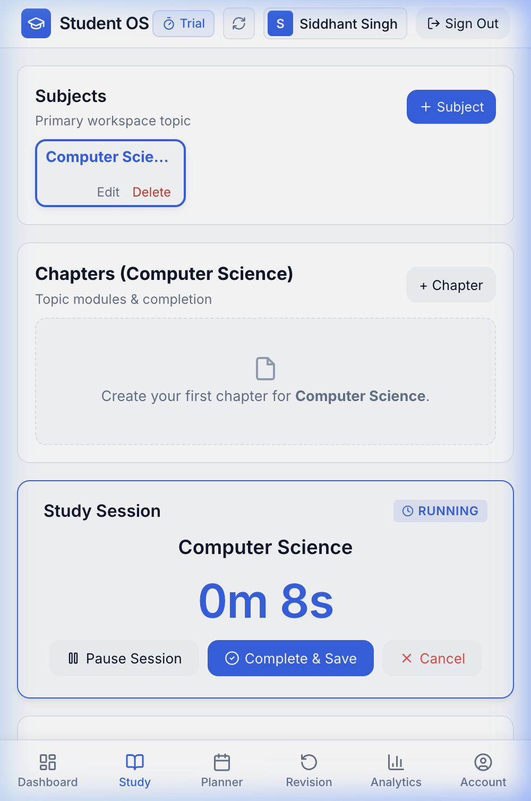

# Study Engine

The **Study Engine** is the core productivity module of Student OS. It manages your academic syllabus, organizes chapters, and tracks your real-time active study sessions using a distraction-free digital timer.

---

## Study Workspace Layout



The Study module is organized into four interconnected functional zones:

```
┌──────────────────────────────────────┬──────────────────────────────────────┐
│ 1. SUBJECTS MANAGEMENT               │ 2. CHAPTERS & TOPICS                 │
│    List of courses, edit & delete    │    Chapter list & completion checks  │
├──────────────────────────────────────┴──────────────────────────────────────┤
│ 3. ACTIVE STUDY SESSION & HIGH-CONTRAST DIGITAL STOPWATCH                   │
│    Timer, Subject/Chapter metadata, Pause, Resume, Complete, Cancel         │
├─────────────────────────────────────────────────────────────────────────────┤
│ 4. TODAY'S FOCUS SUMMARY & CHRONOLOGICAL LOG                                │
│    Total focus time, completed count, and detailed session history          │
└─────────────────────────────────────────────────────────────────────────────┘
```

---

## 1. Managing Subjects & Chapters

### Adding a Subject
1. In the **Subjects** section (top left), click **+ Subject**.
2. Type the subject name (e.g., *Computer Science*, *Organic Chemistry*, *Constitutional Law*).
3. Click **Create Subject**.
4. The subject tile will appear in your workspace. Click any subject tile to highlight and select it.

### Adding & Managing Chapters
1. Select a subject to view its associated chapter module (top right).
2. Click **+ Chapter**.
3. Enter the chapter or unit name (e.g., *Data Structures*, *Thermodynamics*, *Article 21 Fundamental Rights*).
4. Click **Add Chapter**.
5. **Marking Completion**: Each chapter has a checkbox. As you finish topics during your preparation, check the box. The chapter will be struck through, and your Exam Goal Progress will automatically update.

---

## 2. Starting & Running a Study Session



### Launching a Session
1. Click to select the **Subject** you want to study.
2. *(Optional)* Select a specific **Chapter** from the chapter dropdown. If you leave it set to *-- Entire Subject --*, the session logs broadly to that subject.
3. Click **Start Study Session**.

### Live Session Timer Controls

When a session is active, the study card transforms into a high-visibility digital focus screen:

- **Elapsed Time Display**: Displays formatted hours, minutes, and seconds (`HH:MM:SS`) in real time.
- **Subject & Chapter Header**: Clearly reminds you of your active focus topic.
- **Pause Session**: Pauses the timer if you step away for a quick break or interruption. The timer display changes color to amber, and the status badge updates to `PAUSED`.
- **Resume Session**: Resumes counting active focus time.
- **Complete & Save**: Ends the session, permanently commits your logged minutes to your daily study summary and learning analytics, and resets the timer for your next session.
- **Cancel Session**: Discards the active session without saving it to your permanent history (useful if started accidentally).

---

## 3. Today's Focus Summary & Session History

Located below the active timer, the summary card provides a complete log of your productivity for the current day:

1. **Total Focus Time**: Sum of all completed study minutes accumulated today.
2. **Completed Sessions Count**: Total number of successfully completed study blocks.
3. **Chronological Session Log**:
   - Lists every recorded session with the subject name, chapter name, start time (e.g., *Started at 10:30 AM*), and final duration.
   - Status badges indicate whether a session was **COMPLETED**, **CANCELLED**, or **PAUSED**.

---

## 4. Mobile & Android Study Experience

On Android, the study engine includes powerful background tracking capabilities:

| Mobile Study Screen | Active Timer on Android |
| :---: | :---: |
|  |  |

### Android Foreground Service & Status Bar Controls
- When you start a study session on the Student OS Android app, a persistent **Foreground Notification** is created.
- You can minimize the app, switch to your PDF reader, or lock your phone—the timer continues counting accurately without getting killed by Android battery optimization.
- You can **Pause**, **Resume**, or **Complete** your study session directly from your Android notification tray without opening the app.
