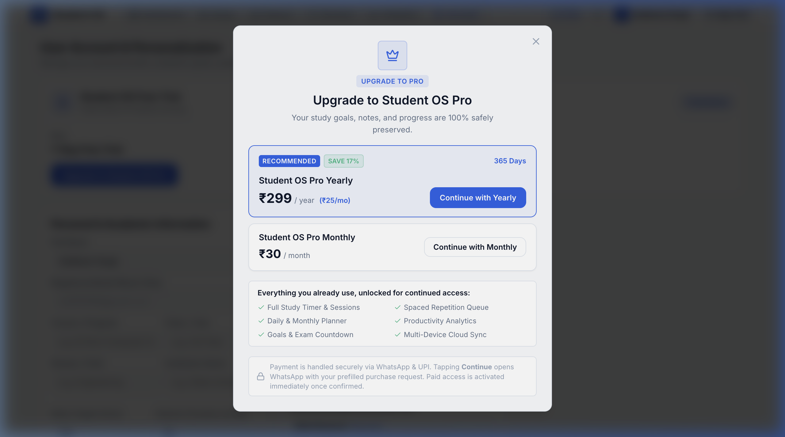

# Free Trial & Pro Subscription

Student OS is designed to provide genuine value before you make any financial commitment. Every new student account receives a full-featured **7-Day Free Trial** upon sign-up.

---

## Pro Upgrade Plans & Pricing

Student OS offers transparent, student-friendly subscription options with no hidden fees or auto-renewing surprise charges:

### 1. Student OS Pro — Yearly Plan ⭐ *(Recommended)*
- **Price**: **₹2,499 / year** *(effective ~₹208 / month)*
- **Duration**: **365 Days Full Access**
- **Highlights**: Best value for long-term exam preparation; includes full syllabus coverage across the entire academic year with significant savings.

### 2. Student OS Pro — Monthly Plan
- **Price**: **₹299 / month**
- **Duration**: **30 Days Full Access**
- **Highlights**: Flexible month-to-month access, ideal for short-term revision sprints or final exam prep.

---

## What is Included in Student OS Pro?

| Feature | 7-Day Free Trial | Student OS Pro |
| :--- | :---: | :---: |
| **Active Study Stopwatch & Focus Logging** | ✅ Unlimited | ✅ Unlimited |
| **Unlimited Subjects & Chapter Management** | ✅ Unlimited | ✅ Unlimited |
| **Daily, Weekly & Monthly Academic Planner** | ✅ Full Access | ✅ Full Access |
| **Spaced Repetition & Retention Scoring** | ✅ Full Access | ✅ Full Access |
| **Complete Learning Analytics & Charts** | ✅ Full Access | ✅ Full Access |
| **Exam Goal Countdown & Pacing Calculator** | ✅ Full Access | ✅ Full Access |
| **Web + Android Cloud Synchronization** | ✅ Included | ✅ Included |
| **Android Background Service & Widgets** | ✅ Included | ✅ Included |
| **Priority Student Support** | Standard | ✅ Priority |

---

## How to Upgrade to Student OS Pro

1. Open **Account & Settings** in the navigation bar or click **Upgrade to Pro** on the Dashboard.
2. The **Upgrade to Student OS Pro** modal will appear displaying the Yearly and Monthly options.
3. Select your preferred billing cycle (**Yearly** or **Monthly**).
4. Click **Upgrade via WhatsApp / Direct Activation**.
5. You will be connected directly with the official Student OS activation team with your Account ID and chosen plan pre-filled.
6. Once payment is confirmed, your account entitlement will be upgraded to **STUDENT OS PRO** immediately.
